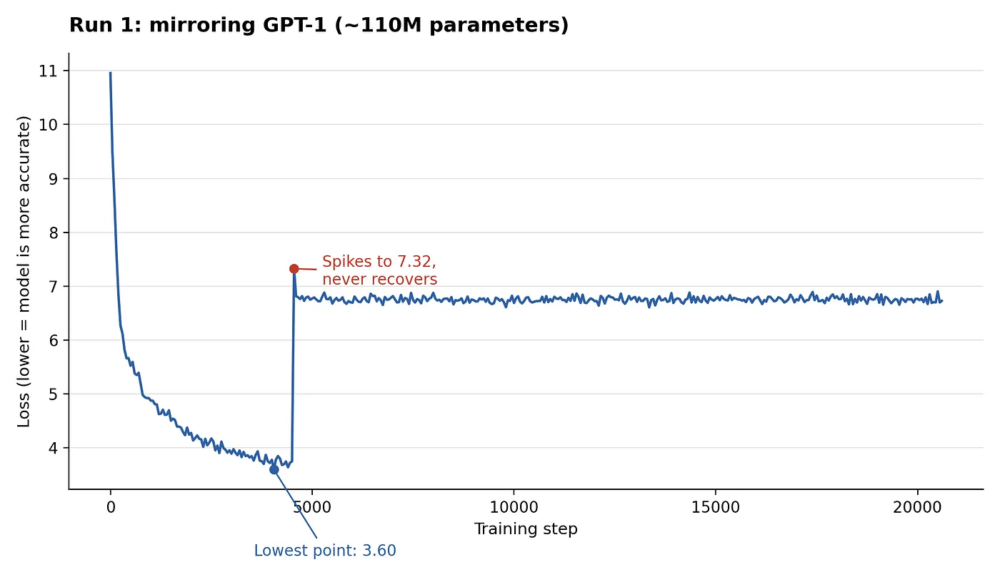
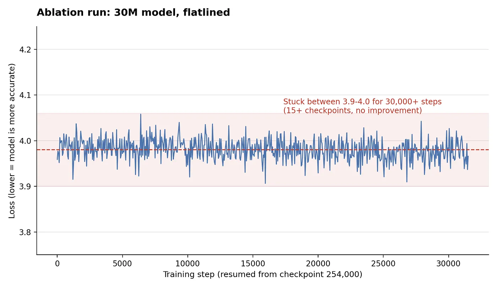
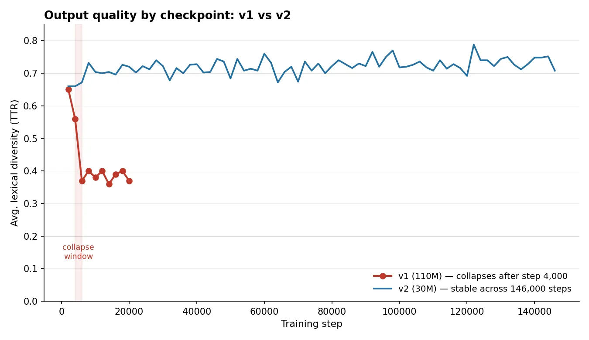
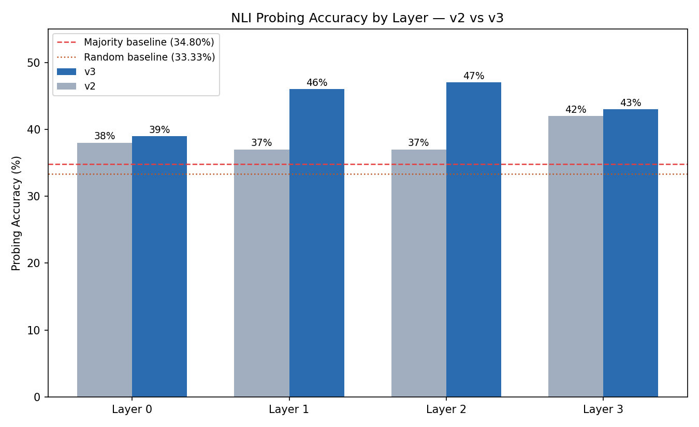
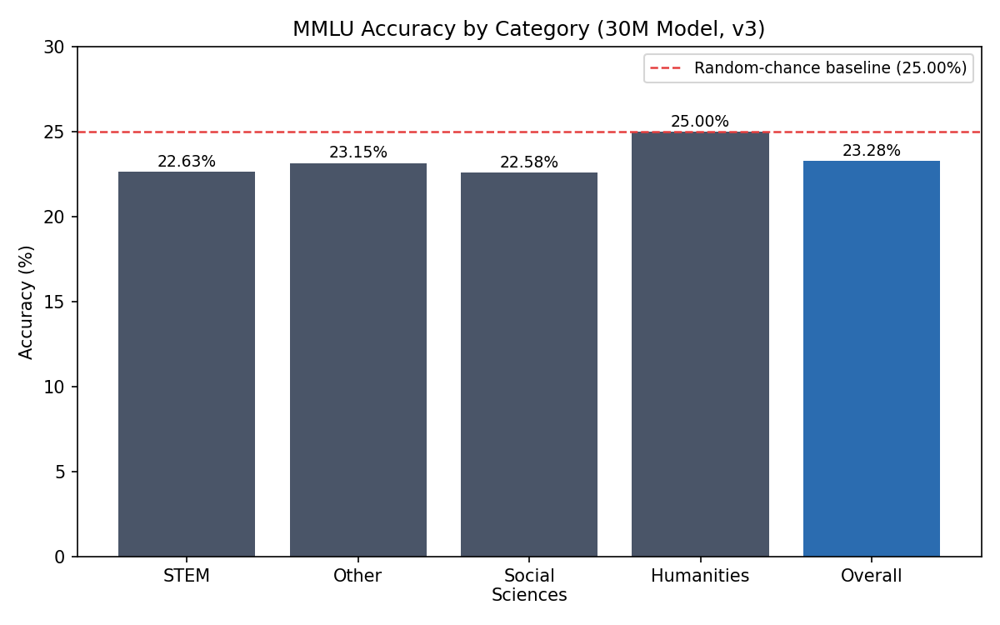
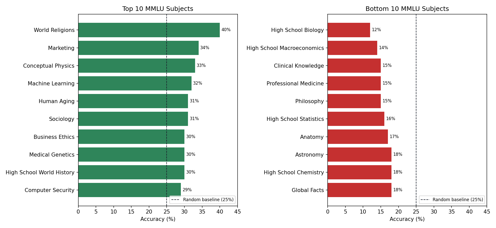

# What Lies Beneath the Prompt: Evaluating What a 30M-Parameter GPT-1-Style Transformer Actually Learns

> **Preprint Documentation & Benchmark Report**  
> **Authors:** Kingsley Nworie, Ayeni Oluwatosin Olawale, Abdullahi Mujaheed Aliyu, Kosi Ashara  
> **Mentor:** Ayo Odumakinde  
> **Codebase:** [github.com/thekingslee/build-an-llm](https://github.com/thekingslee/build-an-llm)  
> **HuggingFace Dataset:** [9ja-bookcorpus](https://huggingface.co/datasets/theKingslee/9ja-bookcorpus) | [fineweb-600m-tokens](https://huggingface.co/datasets/theKingslee/fineweb-600m-tokens)

---

## Abstract

We present a systematic evaluation of a 30-million-parameter, GPT-1-style causal transformer trained from scratch on a mixture of Nigerian-context text and high-quality educational text drawn from FineWeb. Rather than evaluating the model solely through generated outputs, we investigate whether task-relevant knowledge is encoded in its internal representations even when it is not readily accessible through prompting or generation.

We evaluate two checkpoints of the same 30M-parameter architecture, trained under different data and infrastructure conditions (**v2** and **v3**), using the Stanford Natural Language Inference (SNLI) benchmark and the Massive Multitask Language Understanding (MMLU) benchmark. For SNLI, we employ three complementary evaluation strategies: zero-shot perplexity scoring, few-shot perplexity scoring, and linear probing of frozen intermediate representations. Across both checkpoints, generation-independent perplexity-based evaluation produces performance close to chance-level classification baselines, while probing intermediate representations reveals a consistent and non-trivial NLI signal, with the best-performing layer reaching **47.00% accuracy** compared with a 34.80% majority-class baseline.

On MMLU, the more recent checkpoint achieves **23.28% overall accuracy**, below the 25.00% random baseline for four-choice questions. However, performance is heterogeneous across subjects, with several computing-adjacent STEM and humanities domains exceeding the aggregate chance baseline. Together, these findings suggest that even at 30M parameters, a model trained from scratch can develop task-relevant structure in its internal representations before that structure becomes reliably accessible through conventional prompting or generation-based evaluation.

Our results highlight the importance of evaluating small language models at multiple levels of abstraction. Generation-based benchmarks alone may underestimate partially learned structure that is detectable in intermediate representations, motivating a more nuanced evaluation framework for models trained under constrained data and compute regimes.

---

## 1. Introduction

Training a language model from scratch, without the benefit of a large industrial compute budget, is a common exercise for researchers seeking to build practical intuition for the pretraining process, or to produce models tailored to underrepresented languages and cultural contexts not well served by mainstream pretraining corpora. In this work, we construct and evaluate a small causal transformer following the architectural design of GPT-1 (Radford et al., 2018), but at approximately **30 million parameters** rather than the 110 million parameters of the original model. The training corpus combines Nigerian-context text with high-quality educational text, allowing us to investigate both the behavior of a compact language model and the extent to which its learned representations capture task-relevant structure.

The completion of a pretraining run produces a set of learned parameters, but the checkpoint alone provides limited evidence about what the model has actually acquired. Low training loss or fluent-looking generations can indicate that the model has learned statistical regularities without necessarily demonstrating that it can reliably apply those regularities to downstream tasks. That is why we treat evaluation as a central component of the training process rather than as a final reporting step. This report documents our attempt to answer that question rigorously, using two established benchmarks — Natural Language Inference (NLI), evaluated with the Stanford Natural Language Inference (SNLI) dataset, and Massive Multitask Language Understanding (MMLU). Rather than relying solely on qualitative checks (informally termed 'vibe checking') of generated text, we use multiple evaluation strategies designed to probe different aspects of the model's learned capabilities.

A central methodological question we address is: **how should a model of this scale be evaluated?** Standard language-model evaluation often emphasizes zero-shot or few-shot prompting, where the model is expected to interpret a natural-language instruction and produce an appropriate answer. These kinds of evaluations measure an important form of usable capability, but they conflate several factors: knowledge encoded during pretraining, the ability to retrieve that knowledge from the model's representations, and the ability to express the retrieved information through the model's output distribution.

To separate these factors, we evaluate the model at multiple levels. We first use zero-shot and few-shot perplexity-based evaluation to measure whether the model's output distribution can distinguish between competing NLI hypotheses. We then examine the model's internal representations using linear probing of frozen intermediate layers. We ask: 
> *“Even when the model cannot reliably express the correct answer through generation, do its internal representations contain information that is useful for solving the task?”*

The distinction is consequential. If generation-based evaluation and representation-level evaluation produce substantially different results, then a single benchmark score may provide an incomplete picture of the learning taking place inside a small model. Our experiments reveal precisely such a divergence at 30 million parameters: while conventional generation-based evaluation remains close to chance-level performance, intermediate representations contain a consistent and measurable NLI signal.

---

## 2. Background and Related Work

### 2.1 Natural Language Inference
Natural Language Inference (NLI) is a three-way classification task in which a model is given a premise and a hypothesis and must determine whether the hypothesis is **entailed by**, **contradicts**, or is **neutral with respect to** the premise. NLI has been widely used as a benchmark for evaluating semantic understanding and has been incorporated into broader natural language understanding suites, including GLUE and SuperGLUE.

We use the **Stanford Natural Language Inference (SNLI)** dataset (Bowman et al., 2015), which contains human-written premise–hypothesis pairs annotated with the three NLI labels. In our experiments, SNLI serves not only as a downstream classification benchmark but also as a controlled setting in which to compare different ways of extracting information from a small pretrained language model.

### 2.2 Massive Multitask Language Understanding
**MMLU (Massive Multitask Language Understanding)** (Hendrycks et al., 2021) is a broad multiple-choice benchmark spanning 57 subjects across STEM, humanities, social sciences, and other domains. Each question presents four answer choices, making **25%** the uniform random baseline when all choices are equally likely.

MMLU is designed to evaluate knowledge and reasoning across a diverse collection of academic and professional subjects. Its breadth makes it useful for examining whether a pretrained model develops capabilities that extend beyond the specific distribution of its training corpus.

In this study, MMLU provides a complementary evaluation to SNLI. While SNLI focuses on a relatively narrow form of semantic reasoning, MMLU tests a much broader collection of knowledge and reasoning tasks.

### 2.3 In-Context Learning
In-context learning (ICL) refers to the ability of a language model to condition its predictions on examples or demonstrations supplied directly within the input prompt, without updating its parameters through gradient-based training. Few-shot prompting is now a standard evaluation paradigm for large language models.

However, the ability to perform effectively under in-context demonstrations is not guaranteed by the causal language-modeling objective alone. Its relationship with model scale, training data, and other properties of the pretraining process remains an important area of study. This distinction is particularly relevant to our experiments because our 30M-parameter model operates at a substantially smaller scale than contemporary instruction-tuned and few-shot-capable language models.

We therefore treat prompting performance as **one observable form of model capability rather than a complete measure of what the model has learned**.

### 2.4 Representation Probing
Probing is a family of techniques used to investigate what information is encoded in a model's internal representations. A typical probing experiment freezes the pretrained model and trains a lightweight classifier on hidden-state representations extracted from one or more layers. The classifier therefore cannot modify the underlying language model; its performance measures whether information relevant to the target task is **linearly recoverable** from the existing representations.

In this study, we use logistic regression as the probing classifier. We extract hidden representations from intermediate layers of the frozen transformer and train the classifier to predict NLI labels. This provides a complementary perspective to generation-based evaluation: rather than asking whether the language model can directly produce the correct answer, probing asks whether its internal representations contain information from which the correct answer can be recovered by a simple downstream classifier.

> **Key Distinction:**
> - **Generation-based evaluation** asks what the model can express directly;
> - **Representation probing** asks what information is recoverable from the model's internal states.

This distinction forms the basis for our central comparison between behavioral performance and representational structure.

---

## 3. Model and Training Setup

### 3.1 Architecture
The model follows the GPT-1 architecture (Radford et al., 2018) at reduced scale: approximately **30 million parameters**, 256-dimensional embeddings ($d_{\text{model}} = 256$), and **4 transformer decoder layers** ($n_{\text{layer}} = 4$) operating over a sequence length of 512 tokens. This reduced-scale configuration was originally adopted for an ablation study (described in Section 3.3) and was subsequently retained as a fixed architecture across later training runs, so that changes in downstream evaluation could be attributed to training data and setup rather than model capacity.

The model is trained autoregressively using the causal language-modeling objective, predicting each token conditioned on the preceding context.

### 3.2 Data
Training data combined two sources:
- **BookCorpus**, accessed through the `rojagtap/bookcorpus` release on Hugging Face (`books_large_p1.txt` and `books_large_p2.txt`, approximately 4.6 GB combined). BookCorpus was also used in the original GPT-1 training setup. This dataset was used in **v1** and **v2**, paired with the 9ja corpus.
- **9ja-bookcorpus**, a project-curated dataset of rich Nigerian-context text that was collected, cleaned, and processed by the research team (Hugging Face: [`theKingslee/9ja-bookcorpus`](https://huggingface.co/datasets/theKingslee/9ja-bookcorpus)). The dataset was introduced to increase representation of Nigerian literary and cultural contexts within the training distribution. It was used in **v1** and **v2** alongside BookCorpus, and also retained in **v3**.
- **FineWeb-Edu (~600M token split)**, a high-quality educational subset of the FineWeb dataset (Hugging Face: [`theKingslee/fineweb-600m-tokens`](https://huggingface.co/datasets/theKingslee/fineweb-600m-tokens)). This dataset was introduced in **v3** as a replacement for BookCorpus to improve data quality and domain diversity while maintaining the 9ja corpus as a core component.

---

### 3.3 Training History and Dataset Ablation

#### Run 1 (v1 Baseline) Catastrophic Loss Collapse
The project began with a **v1** training run using the original GPT-1-scale architecture of approximately **110 million parameters** ($n_{\text{layer}}=12, d_{\text{model}}=768$) and a mixture of BookCorpus and 9ja-bookcorpus. During training, the run exhibited behavior that we diagnosed as **catastrophic forgetting**. Training loss initially decreased from approximately 11 to 3.60 over the first several thousand steps, indicating substantial learning during the early phase of training. However, the loss subsequently spiked sharply to above 7 within approximately 500 steps and remained elevated for the remainder of the run. This degradation was accompanied by a marked deterioration in generation quality: outputs that had previously exhibited coherent language became ungrammatical.

  
*Figure 1: Training loss curve for Run 1 (~110M parameters) showing initial convergence down to 3.60 before spiking to 7.32 and collapsing.*

```
Prompt: "How are you?" — Same Checkpoint Lineage, Before vs. After Collapse

Step 2,000 (coherent, TTR = 0.65):
"How are you?" He's eyes's blanked. "I'm not supposed to be a fool of a woman." 
She stepped out in. "What do you know?" He paused as the first light of the woman's face looked as if she had come to the woman...

Step 20,000 — final checkpoint (degraded, TTR = 0.37):
How are you? that be . have was ' , . of i n he the . . . a ? with his you on me to , the . a was a . , to , his . it .
```

#### Ablation Study (v2)
To identify the cause, we conducted an **ablation study**, isolating each data source individually at reduced model scale (~30M parameters, 4 layers, $d_{\text{model}}=256$) to control for compute cost. This isolation traced the instability specifically to the **BookCorpus** component: when retrained at reduced scale on the combined data, loss plateaued in a narrow band (approximately 3.9–4.0) for tens of thousands of steps without further improvement.

  
*Figure 2: Ablation run at 30M scale showing loss plateauing in a narrow band (3.9–4.0) across 30,000+ steps.*

A subsequent data-quality investigation of BookCorpus corroborated this: a widely cited audit found substantial duplication (over 2,900 of ~7,185 unique books appearing more than once), rows with non-words, and truncated files within the corpus, consistent with our observation that it was the destabilizing factor.

This 30M-parameter checkpoint from the ablation study is referred to as **v2** throughout this report.

---

### 3.4 Infrastructure and Training Configuration (v3)

Following the ablation, training was migrated from Google Colab to a dedicated **RunPod NVIDIA A100 instance with 80 GB of VRAM**. Persistent `tmux` sessions were used to prevent local connection loss from terminating training processes, while a mounted network volume was used for checkpoint storage. This resolved session-drop issues that had previously interrupted training.

Using the same 30M-parameter architecture as v2, a new training run (designated **v3**) was conducted from scratch on the **FineWeb-Edu and 9ja-corpus** dataset.

#### Summary of Model, Data, and Training Configuration Across Runs

| Parameter / Setting | v1 (Baseline) | v2 (Ablation Checkpoint) | v3 (Final Pretrained) |
| :--- | :---: | :---: | :---: |
| **Parameters** | ~110M | ~30M | ~30M |
| **Layers ($n_{\text{layer}}$)** | 12 | 4 | 4 |
| **Embedding Dim ($d_{\text{model}}$)** | 768 | 256 | 256 |
| **Batch Size** | 64 | 64 | 128 |
| **Datasets Used** | BookCorpus + 9ja | BookCorpus + 9ja | FineWeb-Edu + 9ja |
| **Learning Rate** | $3.0 \times 10^{-4}$ | $3.0 \times 10^{-4}$ | $4.2 \times 10^{-4}$ |
| **Token Budget** | ~1B (collapsed early) | ~200M (plateaued) | ~600M (~20x optimal) |
| **Primary Issue / Status** | Catastrophic Loss Spike | Data Duplication Bottleneck | Stable / High Real-Word Ratio |

#### Training Token Budget
The principal 30M-parameter training configuration was designed around a target of approximately **600 million training tokens**, corresponding to roughly **20 training tokens per parameter**. This places the experiment near the token-to-parameter regime associated with compute-optimal scaling reported by Hoffmann et al. (2022), while keeping the model itself small enough to permit controlled experimentation under limited compute.

---

### 3.5 Qualitative Output Comparison ("Vibe Check")

Before formal benchmarking, all checkpoints were subjected to qualitative analysis from available checkpoints. Generated text was analyzed using two surface-level measures:
1. **Type-Token Ratio (TTR)**: The number of unique generated token types divided by the total number of generated tokens, used as a coarse measure of lexical diversity.
2. **Real-Word Ratio**: The proportion of generated tokens corresponding to valid English words.

  
*Figure 3: Average lexical diversity (TTR) across training steps for v1 vs v2 checkpoints.*

#### Distinct Trajectory Behaviors:
- **v1** underwent a persistent generation collapse between approximately steps 4,000 and 66,000. Outputs became increasingly ungrammatical and did not recover.
- **v2** remained comparatively stable across 74 sampled checkpoints spanning steps 2,000 to 146,000. Its TTR ranged from approximately 0.66 to 0.79, while the real-word ratio ranged from approximately 0.86 to 0.97.
- **v3** avoided the severe collapse observed in v1 and maintained a comparable real-word ratio of approximately 0.88 to 0.96. However, it exhibited a different failure mode: substantially lower lexical diversity, with TTR ranging from approximately 0.35 to 0.51 across 12 sampled checkpoints due to repetitive phrase looping.

---

## 4. NLI Evaluation

### 4.1 Method
We evaluated the best available checkpoints of **v2** and **v3** on the Stanford Natural Language Inference (`stanfordnlp/snli`) benchmark using three complementary evaluation strategies. None involved task-specific fine-tuning:

#### 4.1.1 Zero-Shot Perplexity Scoring
For each SNLI premise–hypothesis pair, we constructed a natural-language prompt containing the premise and hypothesis, followed by a question requesting one of three possible labels. Representative template:
```text
"{premise} Question: {hypothesis} True, False, or Neither? Answer:"
```
For each candidate label, the model's conditional log-likelihood was computed for the corresponding continuation. The candidate with the highest likelihood was selected.

#### 4.1.2 Few-Shot Perplexity Scoring
We repeated the likelihood-based procedure after prepending labeled demonstration examples to the prompt (evaluated at 1 demonstration per class and 2 demonstrations per class).

#### 4.1.3 Representation Probing
The language model was **frozen** throughout the experiment. Mean-pooled hidden-state representations were extracted separately from the premise ($p$) and hypothesis ($h$) at each transformer layer. The feature vector was constructed as:

$$\text{Feature Vector} = [p;\; h;\; |p - h|;\; p \odot h]$$

where `;` denotes concatenation, $|p - h|$ is the element-wise absolute difference, and $p \odot h$ is the element-wise product. A logistic regression classifier was trained on these frozen features to predict the three SNLI labels on a held-out split.

#### 4.1.4 Baselines
- **Random chance**: **33.33%** (uniform 3-class prediction).
- **Majority class**: **34.80%** (always predicting the most frequent class).

---

### 4.2 Results

#### 4.2.1 Perplexity-Based Scoring vs. Baselines (v3)

| Method | Accuracy |
| :--- | :---: |
| **Zero-shot perplexity scoring** | **33.80%** |
| **Few-shot perplexity scoring — 1 example/class** | **35.00%** |
| **Few-shot perplexity scoring — 2 examples/class** | **34.80%** |
| *Majority-class baseline* | *34.80%* |
| *Random baseline* | *33.33%* |

Perplexity-based scoring showed performance remaining very close to the majority-class baseline (34.80%), indicating that neither checkpoint reliably maps premise–hypothesis pairs to the correct label through direct output likelihood.

---

#### 4.2.2 Probing Accuracy by Layer (v2 vs v3)

| Layer | v2 Accuracy | v3 Accuracy |
| :--- | :---: | :---: |
| **Layer 0** | 38.00% | 39.00% |
| **Layer 1** | 37.00% | 46.00% |
| **Layer 2** | 37.00% | **47.00%** |
| **Layer 3 (final)** | 42.00% | 43.00% |
| **Best Layer Overall** | **42.00%** | **47.00%** |
| *Majority baseline* | *34.80%* | *34.80%* |
| *Random baseline* | *33.33%* | *33.33%* |

  
*Figure 4: NLI linear probing accuracy across hidden layers for v2 and v3 compared to majority and random baselines.*

---

### 4.3 Key Probing Findings & Discussion

1. **Intermediate Layer Peak**: The strongest result was obtained from **v3 Layer 2**, where the probing classifier achieved **47.00% accuracy**, **12.20 percentage points above majority baseline** and **13.67 percentage points above random chance**.
2. **Consistent Signal Across Runs**: **v2** also exceeded the majority baseline, reaching **42.00%** at its best layer.
3. **Representational Improvement at Constant Capacity**: Because v2 and v3 share identical 30M architecture ($n_{\text{layer}}=4, d_{\text{model}}=256$), the gain from 42.00% to 47.00% is directly attributable to training data (FineWeb-Edu vs BookCorpus), optimization, and infrastructure configuration.
4. **Abstraction Trajectory**: Performance rises through intermediate layers (Layer 0: 39% $\rightarrow$ Layer 1: 46% $\rightarrow$ Layer 2: 47%) before declining at the final output layer (Layer 3: 43%). This reflects standard representation learning: intermediate layers construct abstract semantic features, whereas the final layer specializes towards the immediate next-token prediction task.

---

## 5. MMLU Evaluation

### 5.1 Method
We evaluated the **v3** checkpoint on the full **Massive Multitask Language Understanding (MMLU)** benchmark comprising **57 subjects and 5,700 questions** (100 four-choice questions per subject; uniform random baseline = **25.00%**).

Evaluation was conducted zero-shot without task-specific fine-tuning. Predicted answers were determined by relative log-likelihood over candidate answer tokens (A, B, C, D).

---

### 5.2 Results

#### 5.2.1 Category-Level Accuracy (30M Model, v3)

| Category | Accuracy | Total Samples | Std. Error |
| :--- | :---: | :---: | :---: |
| **STEM** | 22.63% | 1,900 | $\pm0.96\%$ |
| **Other** | 23.15% | 1,300 | $\pm1.16\%$ |
| **Social Sciences** | 22.58% | 1,200 | $\pm1.20\%$ |
| **Humanities** | 25.00% | 1,300 | $\pm1.20\%$ |
| **Overall Aggregate** | **23.28%** | **5,700** | **$\pm0.56\%$** |

  
*Figure 5: MMLU accuracy across primary categories for 30M v3 checkpoint vs 25% random baseline.*

---

#### 5.2.2 Top 20 MMLU Subjects by Accuracy (v3)

| Subject | Category | Accuracy |
| :--- | :--- | :---: |
| **World Religions** | Humanities | **40.0%** |
| **Marketing** | Other | **34.0%** |
| **Conceptual Physics** | STEM | **33.0%** |
| **Machine Learning** | STEM | **32.0%** |
| **Human Aging** | Other | **31.0%** |
| **Sociology** | Social Sciences | **31.0%** |
| **Computer Security** | STEM | **29.0%** |
| **Business Ethics** | Other | **30.0%** |
| **Medical Genetics** | Other | **30.0%** |
| **High School World History** | Humanities | **30.0%** |
| **Econometrics** | Social Sciences | **28.0%** |
| **US Foreign Policy** | Social Sciences | **28.0%** |
| **Jurisprudence** | Humanities | **28.0%** |
| **Virology** | Other | **27.0%** |
| **Professional Psychology** | Social Sciences | **27.0%** |
| **Electrical Engineering** | STEM | **26.0%** |
| **High School Computer Science** | STEM | **26.0%** |
| **Formal Logic** | Humanities | **26.0%** |
| **High School European History** | Humanities | **26.0%** |
| **High School US History** | Humanities | **26.0%** |

---

#### 5.2.3 Bottom 11 MMLU Subjects by Accuracy (v3)

| Subject | Category | Accuracy |
| :--- | :--- | :---: |
| **High School Biology** | STEM | **12.0%** |
| **High School Macroeconomics** | Social Sciences | **14.0%** |
| **Clinical Knowledge** | Other | **15.0%** |
| **Professional Medicine** | Other | **15.0%** |
| **Philosophy** | Humanities | **15.0%** |
| **High School Statistics** | STEM | **16.0%** |
| **Anatomy** | STEM | **17.0%** |
| **Astronomy** | STEM | **18.0%** |
| **High School Chemistry** | STEM | **18.0%** |
| **Global Facts** | Other | **18.0%** |
| **Management** | Other | **18.0%** |

  
*Figure 6: Top 10 vs Bottom 10 MMLU subject performance comparison for v3 checkpoint.*

---

### 5.3 MMLU Discussion

Overall MMLU accuracy (**23.28%**) sits slightly below the 25.00% random-chance baseline, an expected outcome for a 30M-parameter model trained from scratch. 

However, **20 out of 57 subjects performed above the 25.00% baseline**, with a prominent cluster concentrated in **computing-adjacent STEM fields**:
- **Machine Learning**: **32.0%**
- **Computer Security**: **29.0%**
- **Electrical Engineering**: **26.0%**
- **High School / College Computer Science**: **25.0% – 26.0%**

Humanities was the strongest category overall (**25.00%**), led by **World Religions (40.0%)**, the single best-performing subject across the benchmark.

---

## 6. General Discussion

Taken together, the NLI and MMLU experiments provide a consistent picture of a model whose **internal representations contain measurable task-relevant structure despite weak direct task performance**.

- **NLI Divergence**: Zero-shot and few-shot perplexity scores remained close to chance (~34.80%), yet linear probing of frozen hidden states achieved **47.00% accuracy** at Layer 2 (+12.20% over majority baseline). This proves that statistical structure predictive of entailment is acquired during pretraining even when the output distribution cannot directly express it.
- **MMLU Domain Heterogeneity**: While aggregate accuracy (23.28%) remains near chance, 20 subjects exceed random baseline, concentrated in computing STEM and humanities domains.

These findings highlight a crucial methodological insight: **generation-based prompting alone may underestimate the partial knowledge acquired by small language models**. Probing internal states provides vital complementary evidence.

---

## 7. Limitations

1. **Evaluation Sample Size**: The NLI experiments were conducted across all available NLI datasets, rather than a single benchmark, providing broader coverage of entailment phenomena and improving the robustness of the reported accuracy estimates. In contrast, MMLU provides 100 questions per subject, resulting in relatively high uncertainty at the individual-subject level. Near the 25% baseline, a subject-level accuracy estimate has a standard error of approximately four percentage points.

2. **Single Training Runs**: Each major training configuration, v1, v2, and v3represents a single training run. The experiments therefore do not characterize variance arising from random initialization, data ordering, optimizer stochasticity, or other sources of training randomness. However, the probing and few-shot evaluations were repeated across multiple random seeds and demonstration selections, and the results remained consistent across runs.

3. **Confounded v2 vs v3 Factors**: Although v2 and v3 share the same architecture and parameter count, multiple training variables changed simultaneously between the two configurations, including training data, batch size, stride, learning rate, and infrastructure.
The improvement in probing accuracy therefore cannot be attributed to any individual factor. The comparison establishes an association between the overall v3 configuration and stronger representational performance, but not a causal explanation for that improvement.


---

## 8. Conclusion & Future Work

We evaluated a **30-million-parameter causal transformer trained from scratch** using behavioral prompting and linear representation probing across SNLI and MMLU. While prompting-based scores remained near baseline, linear probing revealed genuine, non-trivial internal representations reaching **47.00% NLI accuracy**.

### Planned Next Steps:
1. **Architecture-Controlled MMLU Comparison**: Evaluate v2 on the full MMLU benchmark to determine whether the subject-level patterns observed in v3 are specific to the revised training configuration.

2. **Representation Dynamics Across Checkpoints**: Repeat the probing evaluation across multiple checkpoints rather than only the selected best checkpoint to determine whether the observed representational signal emerges gradually, peaks at a particular stage of training, or is transient.

3. **Scaling & Supervised Fine-Tuning (SFT)**: Extend training across additional parameter and token scales, and introduce supervised fine-tuning (SFT) stages to evaluate how instruction tuning affects the gap between representation-level signal and generation-based performance, and whether scaling laws differ before and after SFT.


---

## Acknowledgments

This work was carried out by Kingsley Nworie, Ayeni Oluwatosin Olawale, Abdullahi Mujaheed Aliyu, and Kosi Ashara, with training methodology guidance from Ayo Odumakinde. Code and further documentation are available at [github.com/thekingslee/build-an-llm](https://github.com/thekingslee/build-an-llm).

---

## References

1. A. Radford, K. Narasimhan, T. Salimans, and I. Sutskever, *“Improving Language Understanding by Generative Pre-Training,”* OpenAI, 2018.
2. A. Vaswani, N. Shazeer, N. Parmar, J. Uszkoreit, L. Jones, A. N. Gomez, Ł. Kaiser, and I. Polosukhin, *“Attention Is All You Need,”* Advances in Neural Information Processing Systems, vol. 30, 2017.
3. S. R. Bowman, G. Angeli, C. Potts, and C. D. Manning, *“A Large Annotated Corpus for Learning Natural Language Inference,”* in Proceedings of EMNLP, 2015.
4. A. Wang, Y. Pruksachatkun, N. Nangia, A. Singh, J. Michael, F. Hill, O. Levy, and S. R. Bowman, *“SuperGLUE: A Stickier Benchmark for General-Purpose Language Understanding Systems,”* in Advances in NeurIPS, 2019.
5. D. Hendrycks, C. Burns, S. Basart, A. Zou, M. Mazeika, D. Song, and J. Steinhardt, *“Measuring Massive Multitask Language Understanding,”* in International Conference on Learning Representations (ICLR), 2021.
6. T. B. Brown et al., *“Language Models are Few-Shot Learners,”* in Advances in Neural Information Processing Systems, vol. 33, 2020.
7. Y. Belinkov, *“Probing Classifiers: Promises, Shortcomings, and Advances,”* Computational Linguistics, vol. 48, no. 1, pp. 207–219, 2022.
8. J. Hoffmann et al., *“Training Compute-Optimal Large Language Models,”* arXiv:2203.15556, 2022.
9. J. Bandy and N. Vincent, *“Addressing ‘Documentation Debt’ in Machine Learning Research: A Retrospective Datasheet for BookCorpus,”* arXiv:2105.05241, 2021.
10. K. Lee et al., *“Deduplicating Training Data Makes Language Models Better,”* in Proceedings of ACL, pp. 8424–8445, 2022.
11. G. Penedo et al., *“The FineWeb Datasets: Decanting the Web for the Finest Text Data at Scale,”* arXiv:2406.17557, 2024.
